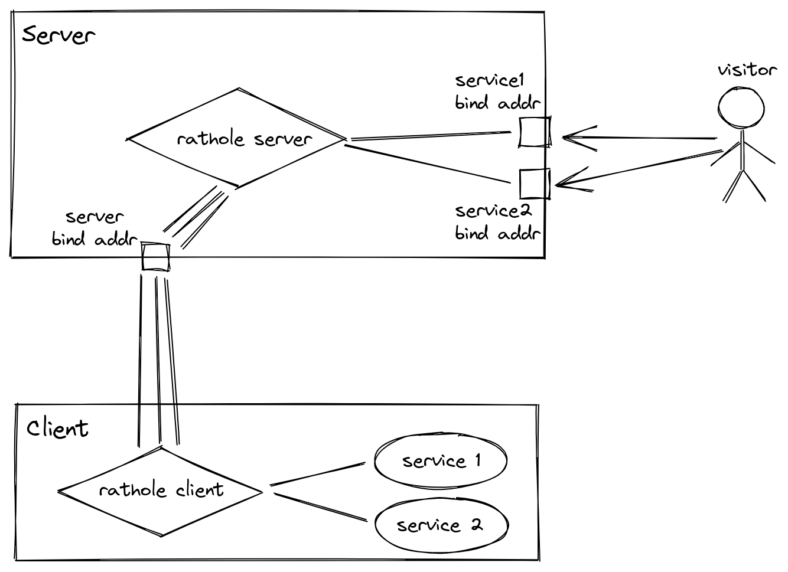

# Penetrate

This project is for self learning and use only, referencing to the project: [rahole](https://github.com/rapiz1/rathole).

referencing the `rathole` instruction:

- A secure, stable and high-performance reverse proxy for NAT traversal, written in Rust

- rathole, like `frp` and `ngrok`, can help to expose the service on the device behind the NAT to the Internet, via a server with a public IP.

further wanted to add:

- support p2p transport traffic, `server` only act as a bridge to acquire the opposite ip address.
- add a webserver to make configure more visible

## Features (from rathole)

- `High Performance` Much higher throughput can be achieved than frp, and more stable when handling a large volume of connections. [Benchmark](docs/benchmark.md)
- `Low Resource Consumption` Consumes much fewer memory than similar tools. [Benchmark](docs/benchmark.md), can be used in embedded devices.
- `Security` Tokens of services are mandatory and service-wise. The server and clients are responsible for their own configs. With the optional `Noise Protocol`,encryption can be configured at ease. No need to create a self-signed certificate! `TLS` is also supported.
- `Hot Reload` Service can be added or removed dynamically by hot-reloading the configuration file.

## Brief software structure:



## Further introduction:

[overview](docs/internals.md)

## Config design:

[configuration](docs/setting.md)

## Application control flow:

[control-flow](docs/control-flow.md)

## How to use?

Both your client and server should have the developer tools of `rust`.

In your `server`:

- git clone this repo.
- `rust build --release`.
- the executable application will be `target/release/penetrate`.
- then write your setting in toml file,
  more examples will be in `examples/` and `tests/`.

here the example settings toml file for server:

```toml
[server]                                       # marked for server
bind_addr = "0.0.0.0:2333"                     # bind the address
default_token = "default_token_if_not_specify" # just yourself, it should same as client token

[server.transport]
type = "tcp" # this server transport is set as `tcp`, more options: `tls`, `noise`

[server.services.echo]     # the service name `echo`, using the binding port 2334
bind_addr = "0.0.0.0:2334"
[server.services.pingpong] # the service name `pingpong`, using the binding port 2335
bind_addr = "0.0.0.0:2335"
```

- and then run the command:

```cmd
penetrate -s (path to the server configuration file)
```

In your `client`:

- git clone this repo
- `rust build --release`
- the executable application will be `target/release/penetrate`
- then write your setting in toml file,
  more examples will be in `examples/` and `tests/`.

here the example settings toml file for server:

```toml
[client]
remote_addr = "127.0.0.1:2333"                 # the remote server address
default_token = "default_token_if_not_specify" # just yourself, it should same as server token

[client.transport]
type = "tcp" # more options: `tls`, `noise`

[client.services.echo]     # offer service name=echo,port=8080
local_addr = "127.0.0.1:8080"
[client.services.pingpong] # offer service name=pingpong,port=8081
local_addr = "127.0.0.1:8081"
```

- and then run the command:

```cmd
penetrate -c (path to the client configuration file)
```

## Sundry

- if you want to use noise framework in transport, which using rust crate `snowstorm`, the `remote_public_key` and `local_private_key` you can use the `penetrate --keygen` to acquire a keypair.

- you should check the server whether open the firewall for the connection port and the service provided ports. And the running project you want to exposed should be the corresponding service port.

- more about the configuration toml writing, you can view a [reference](tests/config_test/valid_config/full.toml)
