# Application control flow

## entry startup

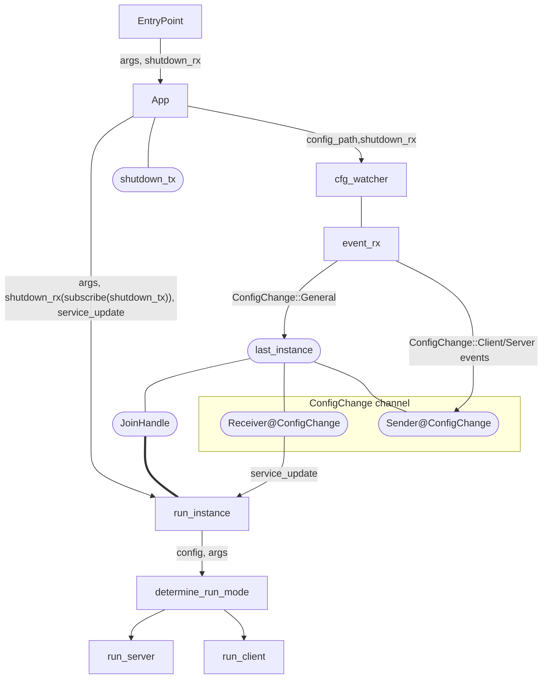

## config watcher handler

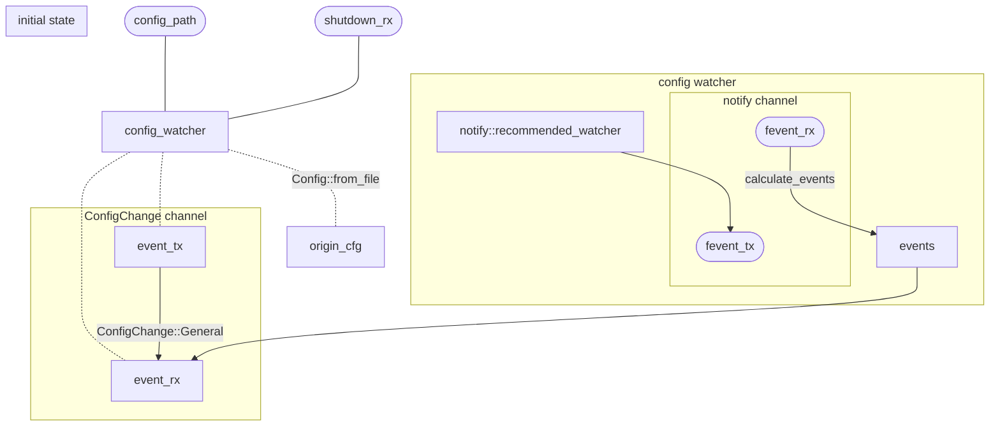

## client startup

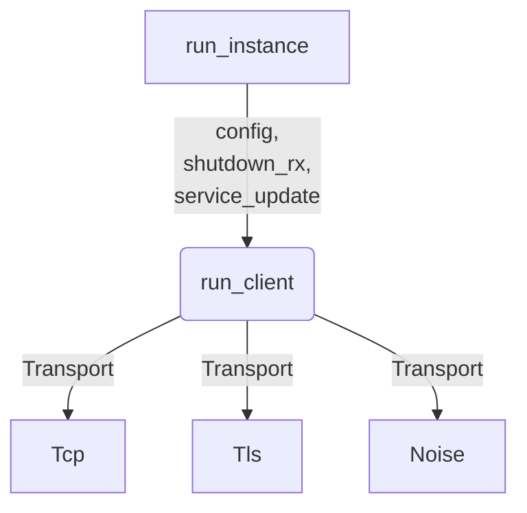

### client running flow

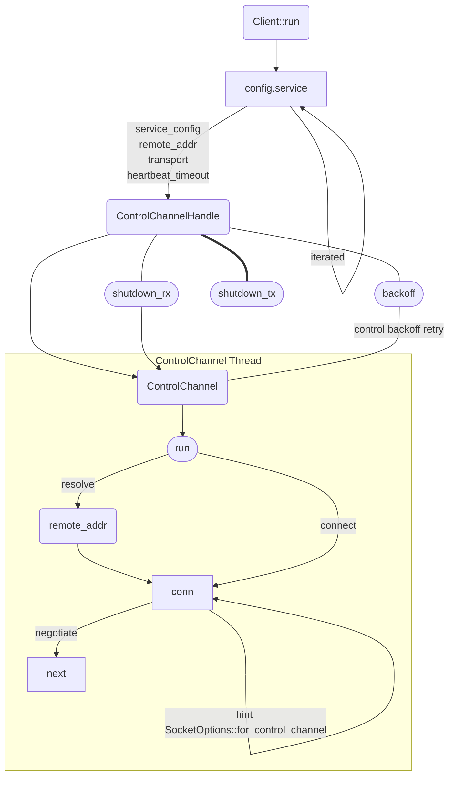

#### negotiate operation

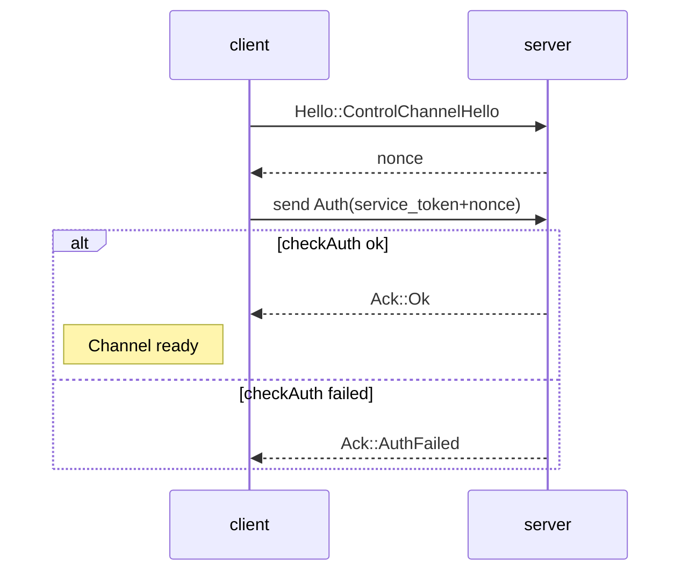

#### startup control channel

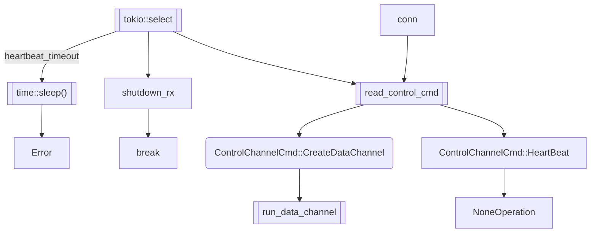

- `read_control_cmd`: read exact `PACKET_LEN.c_cmd` from `conn`, and deserialize it as `ControlChannelCmd`.

#### startup data control channel

`run_data_channel` :

- data channel arguments

```rust
let socket_opts =
  /* use the config marked: nodelay */
  SocketOpts::from_client_cfg(&self.service);

let data_ch_args = Arc::new(RunDataChannelArgs {
  session_key,
  remote_addr,
  connector: self.transport.clone(),
  socket_opts,
  service: self.service.clone(),
});
```

- before data transport: `data_channel_handshake`

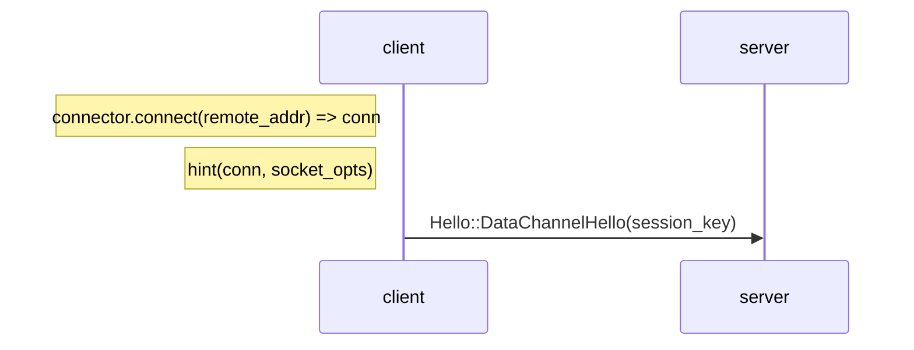

- after data channel handshake :

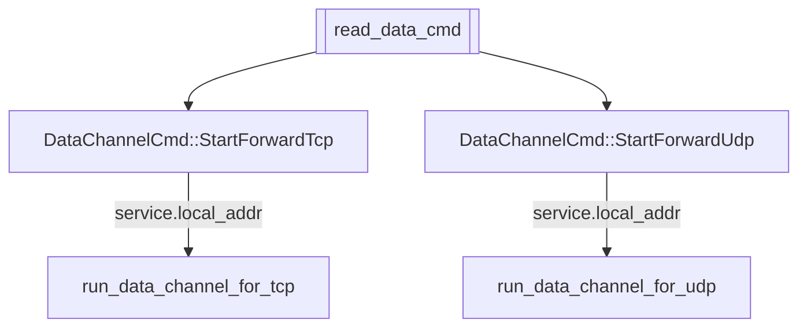

- `run_data_chan  nel_for_tcp`
  main code:

  ```rust
  let mut local =
    TcpStream::connect(local_addr)
  // Copies data in both directions between `conn` and `local`
  tokio::io::copy_bidirectional(&mut conn, &mut local)
  ```

- `run_data_channel_for_udp`

  - udp packet: `UdpTraffic`
    ```rust
    struct UdpHeader {
      /// Sender socket address
      from: SocketAddr,
      /// length of udp packet
      len: UdpPacketLen,
    }
    // packet sequence
    |udp header len| udp header | udp packet data |
    |      u8      |    ...     |       ...       |
    ```
  - `port_map: HashMap<SocketAddr, mpsc::Sender<Bytes>`
  - `outbound_tx` + `outbound_rx` channel with `UDP_BUFFER_SIZE` capacity.
  - `rd: ReadHalf` + `wr: WriteHalf` by `tokio::io::split(conn)`

  ```mermaid
  graph TB
  subgraph channel stores UdpTraffic
    ot(outbound_tx)
    or(outbound_rx)
  end
  subgraph sending items form the outbound channel to the server
    or --> t(UdpTraffic)
    t --> |write| wr --> server((server))
  end

  subgraph read a packet from the server
  rd((rd)) --> read_header --> read_packet --- packet.form --> |check exist| port_map
  end
  port_map --> |is_none| udp_connect
  udp_connect --> |Ok| UdpSocket
  subgraph udp send queue channel
    it(inbound_tx)
    ir(inbound_rx)
  end
  UdpSocket --- it --> |insert| port_map
  UdpSocket --- ir
  ot --> ruf[[run_udp_forward]]
  ir --> ruf
  udp_connect --> Err
  port_map --> |is_some| tx --> |send| packet.data
  ```

  `udp_connect`:
  main code:

  ```rust
  let addr = to_socket_addr(addr).await?;

  let bind_addr = match addr {
    SocketAddr::V4(_) => "0.0.0.0:0",
    SocketAddr::V6(_) => ":::0",
  };

  let s = UdpSocket::bind(bind_addr).await?;
  s.connect(addr).await?;
  ```

  `run_udp_forwarder`

  ```mermaid
  graph TB
    t[[tokio::select]]
    t --> |recv| ir(inbound_rx) --> |send data| s
    t --> |recv| s(UdpSocket)
    s --> |"send (len + UdpTraffic)"| ot(outbound_tx)
    t --> ts[["time::sleep"]]
  ```

## server configure

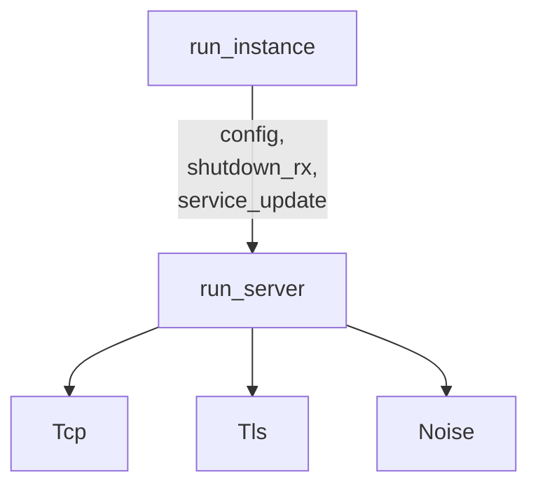

### server run

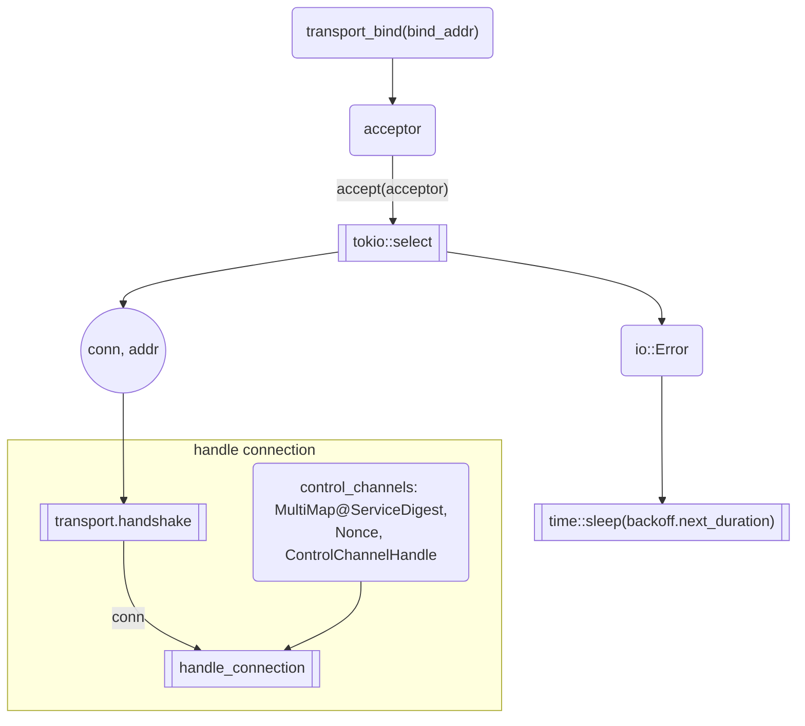

- `handle_connection`

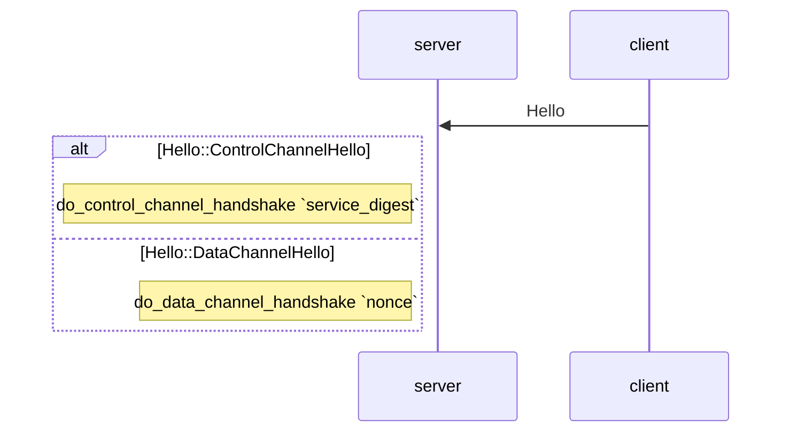

- `do_control_channel_handshake`

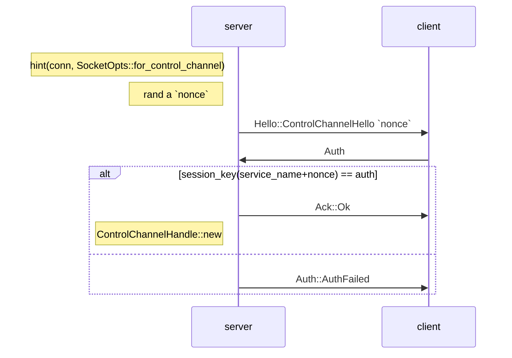

### control channel handle

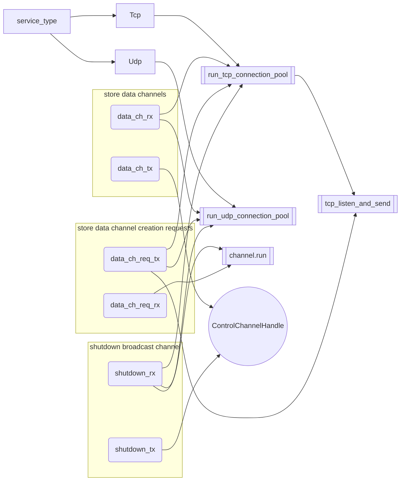

- `tcp_listen_and_send -> rx`

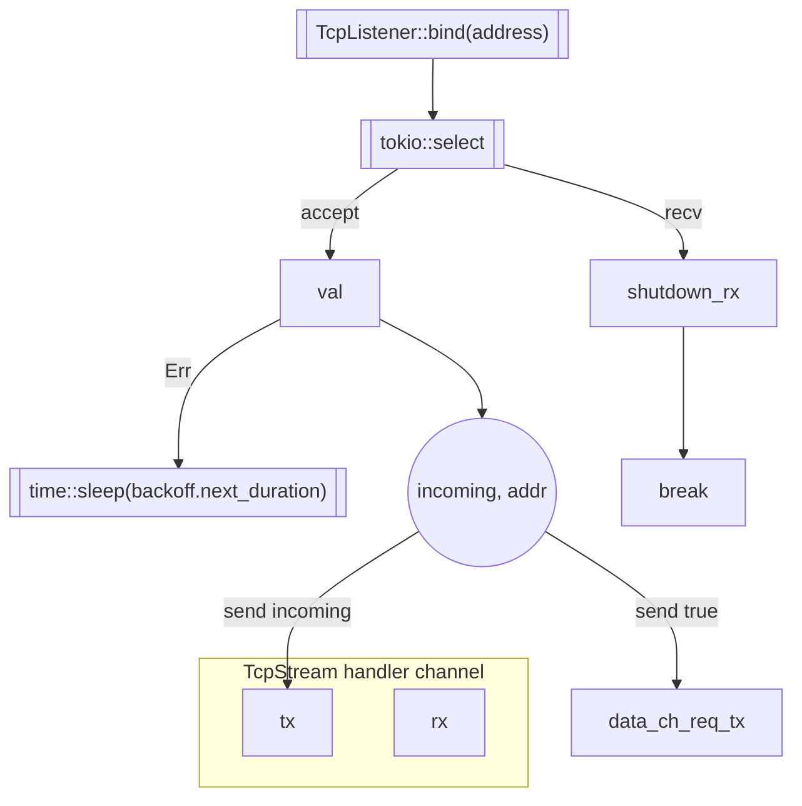

- `run_tcp_connection_pool`

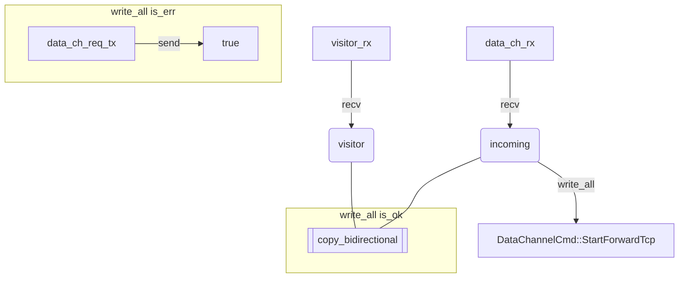

- `run_udp_connection_pool`

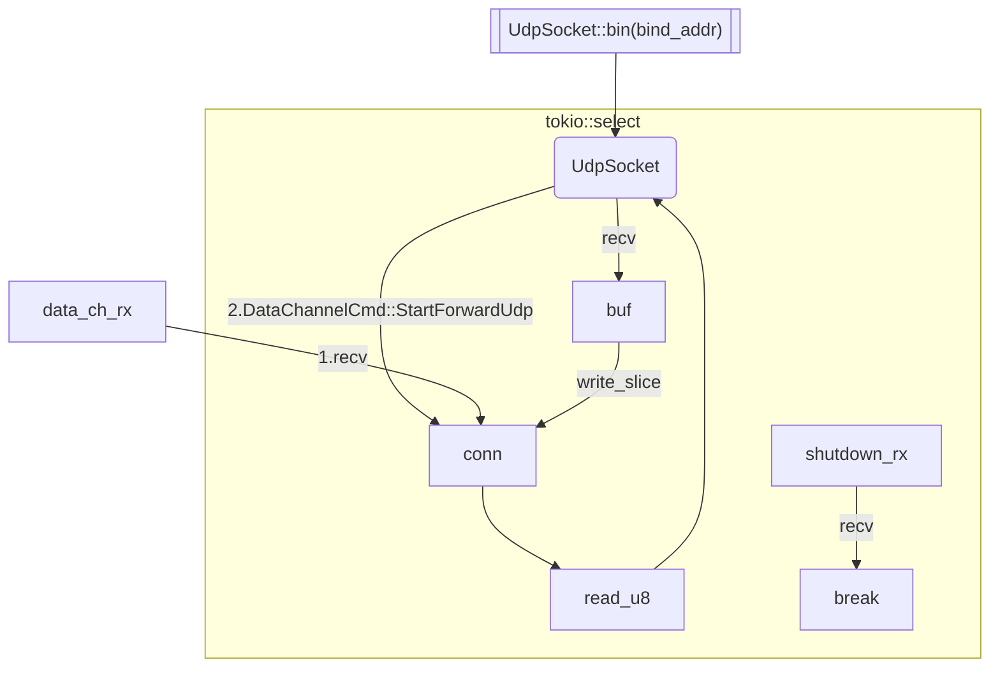

### control channel

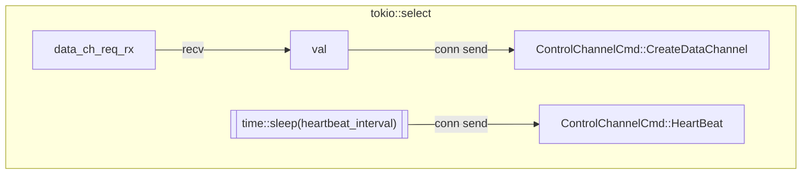

### data channel handshake

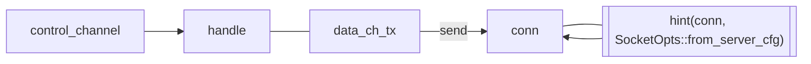
